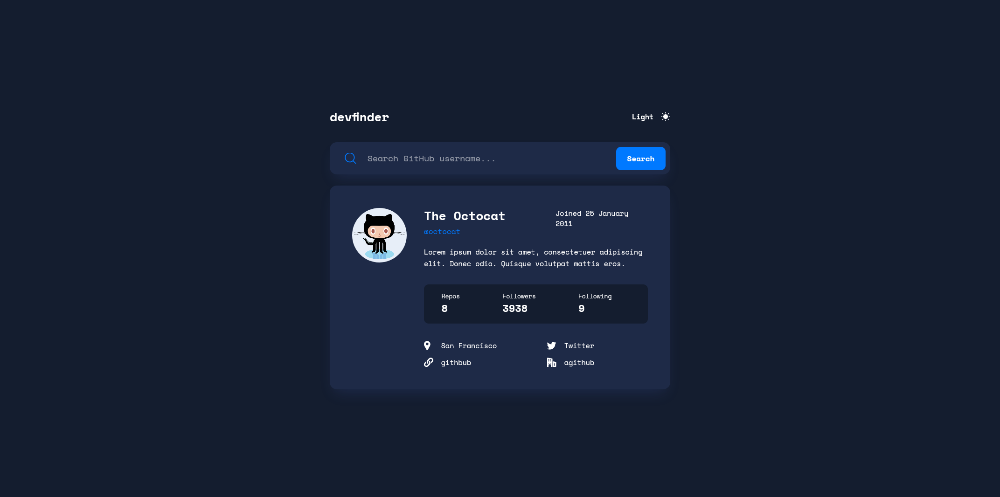

# Frontend Mentor - GitHub user search app solution

This is a solution to the [GitHub user search app challenge on Frontend Mentor](https://www.frontendmentor.io/challenges/github-user-search-app-Q09YOgaH6). Frontend Mentor challenges help you improve your coding skills by building realistic projects.

## Table of contents

- [Overview](#overview)
  - [The challenge](#the-challenge)
  - [Screenshot](#screenshot)
  - [Links](#links)
- [My process](#my-process)
  - [Built with](#built-with)
  - [What I learned](#what-i-learned)
  - [Continued development](#continued-development)
  - [Useful resources](#useful-resources)
- [Author](#author)
- [Acknowledgments](#acknowledgments)

**Note: Delete this note and update the table of contents based on what sections you keep.**

## Overview

### The challenge

Users should be able to:

- View the optimal layout for the app depending on their device's screen size
- See hover states for all interactive elements on the page
- Search for GitHub users by their username
- See relevant user information based on their search
- Switch between light and dark themes
- **Bonus**: Have the correct color scheme chosen for them based on their computer preferences. _Hint_: Research `prefers-color-scheme` in CSS.

### Screenshot

### Links

- Solution URL: [Add solution URL here](https://your-solution-url.com)
- Live Site URL: [Add live site URL here](https://your-live-site-url.com)

## My process

This challenge was really fun and not that hard at all !
My architecture is not clean though, also my implementation of dark mode is quite dirty. In fact I was planning to use SASS maps and @each to implement different themes, but that was quite too complex and time consuming for me.
It was my first time using Sass, and I could definitly have done better in organizing this mess.
(especially for Media Queries)
Concerning the work flow, I started by building the desktop design, with the API data in mind for later implementation.
I then coded the light/dark toggle.
Now it was time for that API, so I link my searchView to my model to fetch a query to the API, and store that user data in my model.state .
Then i just had to throw errors and render the new markup, and voilà !

(I added the two media queries quickly with SASS and an external mixin named "include-media)

### Built with

- Semantic HTML5 markup
- SASS
- Flexbox
- CSS Grid
- Desktop-First Workflow
- JavaScript
- npm

### Continued development

## Author

- Frontend Mentor - [@MCkeydev](https://www.frontendmentor.io/profile/MCkeydev)

## Acknowledgments

I want to acknowledge and thanks all the people that will look at my solution, and eventually, this readme file. Thank you !
